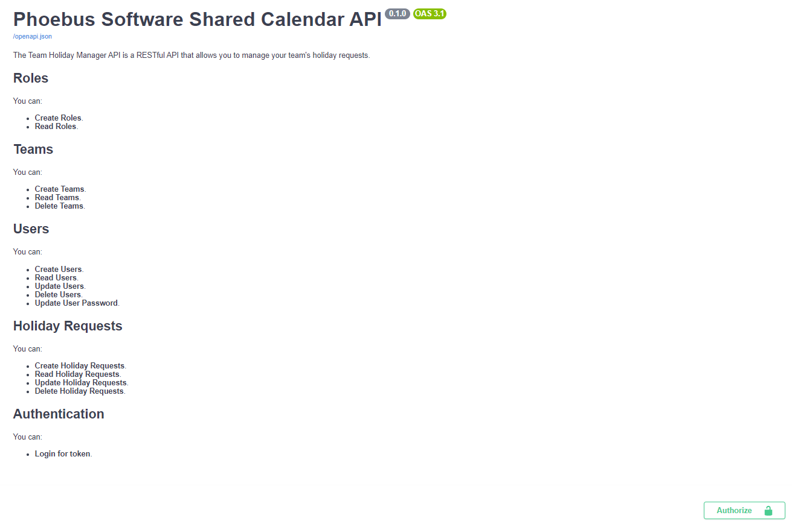

# TeamHolidayManager

Fast API project to manage holiday requests using a postgres database.
Also manages a list of teams, users within their teams and their application privileges.

You can interact with the API using the swagger docs hosted on AWS or by running the project locally (please follow steps from Getting Started when running locally).

# SwaggerDocs

## Live SwaggerDocs

To access the swagger docs you can go to the following url https://9rwoprs2o3.execute-api.eu-west-2.amazonaws.com/prod/docs#/

Screenshot of SwaggerDocs


## Local SwaggerDocs
To access the swagger docs you can run the project locally and go to the following url http://localhost:8000/docs

# Getting Started

## Prerequisites

- Docker desktop
- Python 3.11.4
- pip 21.3.1

## Installation

1. Clone the repo
   ```sh
   git clone
    ```
2. Install python 3.11.4 or the latest version https://www.python.org/downloads/

3. Install Docker desktop - https://docs.docker.com/desktop/install/windows-install/

4. Install pip 21.3.1

5. Install the required python packages
   ```sh
   pip install -r requirements.txt
   ```

## Running the project

### Running the project with docker
1. Run the docker containers
   ```sh
   docker-compose up

2. Go to the following url to access the swagger docs
    ```sh
    http://localhost:8000/docs
    ```

### Running the project without docker
1. Uncomment the 2nd database url in the .env file and comment out the first one.

2. cd into the src directory
   ```sh
   cd src
   ```

3. Run the following command to start the project
   ```sh
   uvicorn main:app --reload
   ```